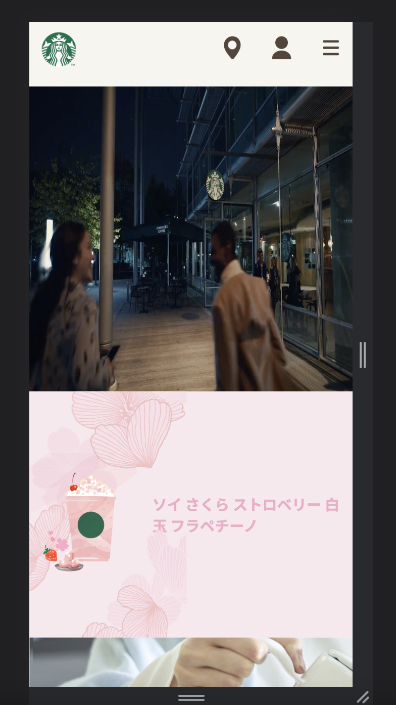

<!-- @format -->

# ☕ starbucks-jpn-Website

✨ Japanese Starbucks toy project
 

## Screenshot

## Mobileshot

 

[🫘 Visit my Starbucks](https://topgun0415.github.io/starbucks-jpn-clone/)

 

`Frontend`

 

 

## 💡 About my project

First my own Javascript project to create a Japanese Starbucks website

## 💡 Purpose of Project

- To imporve Javascript & Html & Css
- My final Vanilla Javascript project

 

## ⚙️ What is a feature of a project?

- ### Main page
  - Font change
  - Dropdown Navbar only with vanliia js
  - Carousel slider
  - Click banner to move screen
  - Responsive screen (Mobile, Tablet)
  - Following banner & delete btn
  - Simple moving annimation
     

## 🚨 What was a difficulty with project?

### Main page

- HTML : Attributes & Some tags rarely use
- SASS : Responsive website (rem,em,%,vw)
- JS : Event bubbling

## ✏️ Things I learn with this project

- ### Main page

  - CSS
    - Fonts
    - Fixed & Sticky
    - Carousel Slider (Glide.js)
    - Media query (Especially Breakpoints)
    - Some libraries
    - Animation & Transition
      ​
  - JS
    - Event Bubbling
    - classList Methods
    - Dropdown logic

## 🧑‍💻 What were good points of this project?

When my crome-app project finished, I realized that my javascript level is too low. Then I spent almost 2 months to study core javascript such as event loop, call stack, All of Array methods, execution context, closure etc..

I actually have no chance to use all of them but I think my javascript level became much better than before (my first crome-app project).
